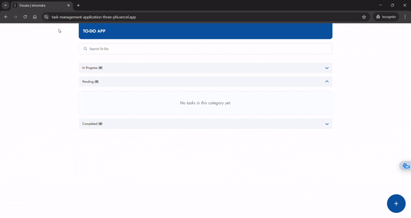

# Task Management App - Tresata Assessment

A modern, responsive task management application built with React and TypeScript. This project focuses on a clean user interface, robust state management, and a professional development workflow to deliver a great user experience.

### 🚀 Live Demo

[https://task-management-application-o81gb5r9y-ishvendra-singhs-projects.vercel.app/]

### 📸 Preview



### ✅ Features

#### Core Features

- Full CRUD Functionality: Create, Read, Update, and Delete tasks.

- Status Columns: Tasks are organized into "Pending", "In Progress", and "Completed" categories.

- Responsive Design: A mobile-first design that adapts seamlessly to desktop viewports.

- Client-Side Routing: Uses React Router for dedicated "Add Task" and "Edit Task" pages.

#### Advanced Features & UX

- Debounced Search: A performant search that filters tasks only after the user has paused typing.

- Persistent State: Application state is saved to Local Storage, so your tasks are there when you return.

- Accordion Lists: Task columns can be collapsed and expanded.

- Smart Truncation: Long titles and descriptions are truncated with an ellipsis to maintain a clean layout.

- Informative Tooltips: Hover over truncated text to see the full content.

- Auto-Resizing Textarea: The description field in forms automatically grows as you type.

- Minimalist Delete Confirmation: A space-saving, two-click delete interaction with a shake animation keeps the user from accidentally deleting tasks.

- Toast Notifications: Clean, non-intrusive notifications for adding, updating, and deleting tasks.

### 🛠️ Tech Stack

- Framework: React 19

- Language: TypeScript

- Build Tool: Vite

- Styling: CSS Modules & CSS Variables

- Routing: React Router

- State Management: React Hooks (useReducer, useContext)

- Linting/Formatting: ESLint & Prettier

### 🏗️ Architecture & Design Decisions

#### Project Structure

The project uses a feature-sliced architecture. All files related to a specific feature (like tasks) are co-located, making the codebase scalable and easy to navigate.

```
src/
├── pages
│ ├── tasks-page
│ ├── add-task
│ └── edit-task
├── assets/icons    # SVG icons
├── components/     # Reusable, generic components
├── features/tasks
│ ├── components/   # Task-specific components
│ ├── state/        # Reducer and Context for state management
│ └── types.ts      # TypeScript types for the tasks feature
├── hooks/          # Reusable custom hooks
└── utils/          # Utility functions
```

#### State Management

State is managed globally using a combination of `useReducer` and `useContext`. This avoids prop-drilling and centralizes all state-transition logic into a single, predictable reducer function.

#### Custom Hooks

- `useDebounce`: Efficiently debounces the search input to prevent excessive re-renders while the user is typing.

- `useOnClickOutside`: A reusable hook to handle clicks outside of a specific element, used for closing popovers and interactive elements.

#### 🏃‍♂️ Running the Project Locally

To run this project on your local machine, follow these steps:

1. Clone the repository

```
git clone https://github.com/Ishvendra/Task-Management-Application.git

cd Task-Management-Application
```

2. Install dependencies

```
npm install
```

3. Run the development server

```
npm run dev
```

The application will be available at `http://localhost:5173`.
